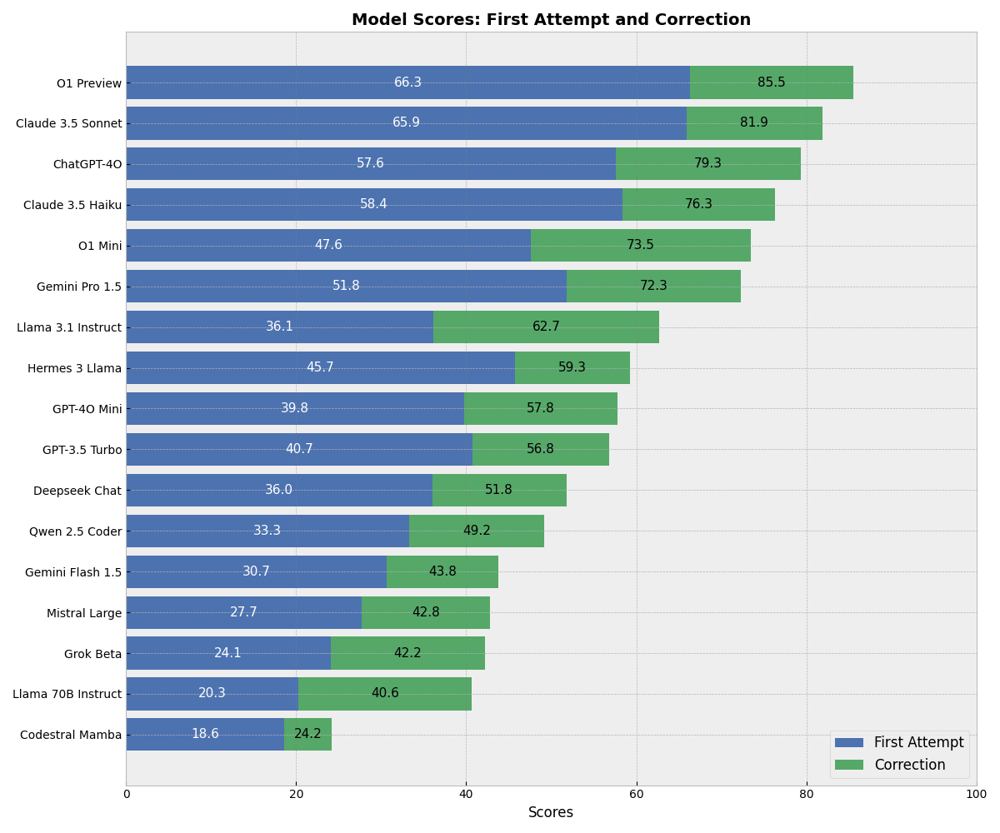

# Rust Compiling Benchmark #

This is a small benchmark to test how well coding LLMs can write Rust code that compiles, without evaluating whether the code is correct in any other way.

### Introduction ###

The Rust compiler is famously strict. This strictness is necessary for the memory safety that Rust provides, and a Rust program that compiles is less likely to have runtime errors compared to programs in other languages. However, as I have experienced many times, writing a Rust program that compiles can be far from trivial.

I have also noticed that language models are not much better than I am at this task; often, their suggestions fail to compile as well. Therefore, I wanted to compare how proficient different models are at this task and how this task compares to other "reasoning" tasks, such as solving advanced math problems and competitive programming challenges.

Of course, the benchmark can easily be gamed simply by writing a "Hello World" program that compiles for every question. However, all the models I am testing have been evaluated in other benchmarks, and it is safe to assume they are genuinely attempting to solve the problems.

## Results ##



| Model | Total | | Hard Problems | | Easy Problems | |
|-------|--------|--------|---------------|--------|---------------|--------|
| | First Attempt | Correction | First Attempt | Correction | First Attempt | Correction |
| **Closed Source Models** |||||||
| openai/o1-preview-2024-09-12 | 66.3% | 85.5% | 47.5% | 75.0% | 83.7% | 95.3% |
| openai/o1-mini-2024-09-12 | 48.2% | 73.5% | 25.0% | 56.2% | 69.8% | 89.5% |
| openai/gpt-4o-mini | 38.6% | 58.3% | 14.8% | 35.0% | 60.9% | 79.9% |
| openai/chatgpt-4o-latest | 58.1% | 79.3% | 33.8% | 60.4% | 80.7% | 96.9% |
| openai/gpt-3.5-turbo-0125 | 39.8% | 55.8% | 22.5% | 40.8% | 55.8% | 69.8% |
| anthropic/claude-3.5-sonnet | 65.9% | 81.9% | 47.2% | 68.3% | 83.3% | 94.6% |
| anthropic/claude-3-5-haiku | 55.6% | 75.6% | 35.8% | 59.6% | 74.1% | 90.4% |
| google/gemini-pro-1.5 | 51.8% | 72.3% | 28.8% | 50.0% | 73.3% | 93.0% |
| google/gemini-flash-1.5 | 27.3% | 46.9% | 10.2% | 29.4% | 43.2% | 63.2% |
| x-ai/grok-beta | 24.1% | 42.2% | 6.2% | 17.5% | 40.7% | 65.1% |
| **Open Source Models** |||||||
| qwen/qwen-2.5-coder-32b-instruct | 35.3% | 51.4% | 14.2% | 25.7% | 54.8% | 75.3% |
| nousresearch/hermes-3-llama-3.1-405b | 45.0% | 59.0% | 16.2% | 31.2% | 71.7% | 84.9% |
| meta-llama/llama-3.1-405b-instruct | 36.1% | 62.7% | 7.5% | 32.5% | 62.8% | 90.7% |
| meta-llama/llama-3.1-70b-instruct | 20.1% | 42.2% | 10.0% | 24.6% | 29.5% | 58.5% |
| mistralai/mistral-large-2411 | 27.7% | 42.8% | 6.2% | 22.5% | 47.7% | 61.6% |
| mistralai/codestral-mamba | 18.6% | 24.2% | 3.5% | 9.0% | 32.6% | 38.4% |
| deepseek/deepseek-chat | 35.5% | 52.4% | 10.0% | 27.5% | 59.3% | 75.6% |
| microsoft/phi-3.5-mini-128k-instruct | 0.6% | 1.2% | 0.0% | 0.0% | 1.2% | 2.3% |
| liquid/lfm-40b | 4.2% | 4.2% | 1.2% | 2.5% | 7.0% | 5.8% |

And with several attempts:

| Model | Total ||| Hard ||| Easy |||
|-------|-------|-------|-------|-------|-------|-------|-------|-------|-------|
| | Pass@1 | Pass@3 | Pass@7 | Pass@1 | Pass@3 | Pass@7 | Pass@1 | Pass@3 | Pass@7 |
| openai/o1-preview-2024-09-12 | 85.5 | - | - | 75.0 | - | - | 95.3 | - | - |
| anthropic/claude-3-5-haiku | 75.6 | 90.2 | 94.4 | 59.6 | 81.2 | 88.3 | 90.4 | 98.7 | 100.0 |
| qwen/qwen-2.5-coder-32b-instruct | 51.4 | 72.1 | 82.4 | 25.7 | 49.2 | 64.9 | 75.3 | 93.4 | 98.8 |
| openai/gpt-4o-mini | 58.3 | 77.6 | 88.1 | 35 | 59.2 | 76.3 | 79.9 | 94.7 | 99.1 |
| anthropic/claude-3.5-sonnet | 81.9 | 89.2 | - | 68.3 | 80.0 | - | 94.6 | 97.7 | - |
| google/gemini-flash | 46.9 | 73.5 | - | 29.4 | 60.0 | - | 63.2 | 86.0 | - |

## Benchmark ##

Currently, there are 83 questions. Some problems ask for concrete results, making it easy to write tests to verify if the code is correct (beyond simply compiling). Others are high-level descriptions, making it harder to evaluate the quality of the model's solution. In such cases, successful compilation provides an easy-to-check metric.

All models are evaluated in a zero-shot manner. If the code fails to compile, the error message is provided to allow the model to attempt a correction. I have categorized the problems into "easy" and "hard" based on how often they were solved correctly. There are 40 hard problems and 43 easy ones.

The easiest problem is:

```
Write a Rust program that calculates the factorial of a given number using recursion.*
```

The hardest is:

```
Write the rust code for a social network website.

We will need to be able to:

- Add a user to the network.
  A user has:
  - A unique username.
  - A list of friends. (Initially empty)
  - A list of posts. (Initially empty)
  - Name
  - Age
- Remove a user from the network.
- Add a friendship. A friendship is a mutual relationship between two users. If user A is friends with user B, then user B is friends with user A.
- Get the friends of a user.
- Remove a friendship.
- Given two users, find the shortest path between them. The path should be a list of users starting with the first user and ending with the second user. If there is no path, return None.
- Make a post. A post has:
  - A unique id.
  - The user who made the post.
  - The content of the post.
  - The time the post was made.
- Get the posts of a user.
- Get the posts of a user's friends.
- Get the posts of a user's friends of friends.
- Get the posts of a user's friends for a given time period.
```

Some of the questions, like the ones above, do not specify anything specific to Rust, while others do:

```
Create a declarative macro tree! that builds a tree structure.

- tree!(value) -> Create a leaf node with the given value.
- tree!(value, child1, child2, ...) -> Create a node with the given value and children.

The tree! macro should be able to handle any number of children.
It should handle any type that implements clone.
The resulting tree should be immutable.
```

## Cost ##

The total cost has been approximately $70, with almost 50% of it resulting from running o1-preview once for each problem.


